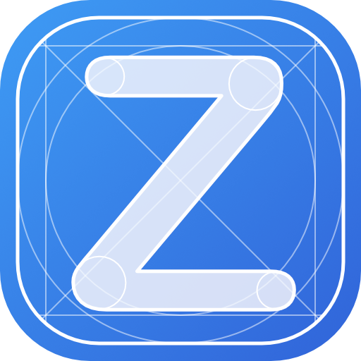

<figure markdown>
  { width=128 }
</figure>

<h1 class="title">Zeichenmaschine.xyz</h1>
<h2 class="subtitle">Eine kleine Java-Bibliothek für grafische Programmierung im 
Informatikunterricht.</h2>

## Projektidee

Die **Zeichenmaschine** ist eine für den Informatikunterricht entwickelte
Bibliothek, die unter anderem an [Processing](https://processing.org/) angelehnt
ist. Die Bibliothek soll einige der üblichen Anfängerschwierigkeiten mit Java
vereinfachen und grafische Ausgaben für Schülerinnen und Schüler im Unterricht
leichter nutzbar machen.

!!! warning

	Das Projekt befindet sich noch in der Entwicklungsphase und auch wenn die 
	aktuelle Version schon funktionsfähig ist und einen Großteil der angestrebten 
	Funktionen enthält, ist noch keine stabile Version 1.0 erreicht. Vor allem 
	am Umfang und konsistenten Design der APIs gilt es noch zu arbeiten und es 
	können sich Änderungen ergeben.

	Feedback und Vorschläge zu diesem Prozess (oder auch eine Beteiligung an der 
	Entwicklung) können sehr gerne über [Github](https://github.com/jneug) oder 
	[Mastodon](https://bildung.social/@ngb) an mich kommuniziert werden.
	
	(Gleiches gilt für diese Webseite zum Projekt.)

## Dokumentation

* [Schnellstart](quickstart.md)
* [Installation](installation.md)
* {{ javadoc_link() }}

## Über die Zeichenmaschine

Die _Zeichenmaschine_ ist aus dem Wunsch entstanden, nach einer Einführung in
die Grundlagen der Programmiersprache Java mit Processing, einen Übergang zur
objektorientierten Modellierung und Programmierung mit BlueJ zu leichter zu
ermöglichen. Mit Processing kann zwar auch objektorientiert programmiert werden,
aber mit Blick auf die Sekundarstufe II in NRW ist ein Wechsel zu einer
generellen Programmierumgebung wie BlueJ wünschenswert.

Die Motivation von Processing, schnell grafische Ergebnisse der eigenen
Programme zu sehen, sollte aber für den Übergang erhalten bleiben. So ist eine
kleine Bibliothek mit minimalen Abhängigkeiten entstanden, die an Processing
angelehnt einfache Schnittstellen bereitstellte, um Programmen eine grafische
Ausgabe zu ermöglichen, ohne viel "Boilerplate" Code schreiben zu müssen.

Aus diesen Anfängen ist nach und nach eine umfassende Grafikbibliothek
entstanden, die als _Zeichenmaschine_ veröffentlicht wurde.

### Was die Zeichenmaschine nicht ist

Die Bibliothek hat nicht den Anspruch, ein Konkurrent zu Processing oder
anderen, seit Jahren etablierten und ausgereiften, Grafiksystemen zu sein. Vor
allem ist die _Zeichenmaschine_ keine vollwertige Game Engine, die auf die
Ausführung komplexer Spiele spezialisiert ist. Für diese Zwecke gibt es genügend
Alternativen, von deren Nutzung gar nicht abgeraten werden soll.

## Aufbau der Zeichenmaschine 

!!! info

	In der Zeichenmaschine werden bewusst nur englischsprachige Bezeichner für 
	Klassen, Methoden und Variablen verwendet. Ausnahme sind einzelne Klassen,
	die im Zusammnehang mit dem Namen der Bibliothek stehen, wie die
	Hauptklasse `Zeichenmaschine`.

Foo
