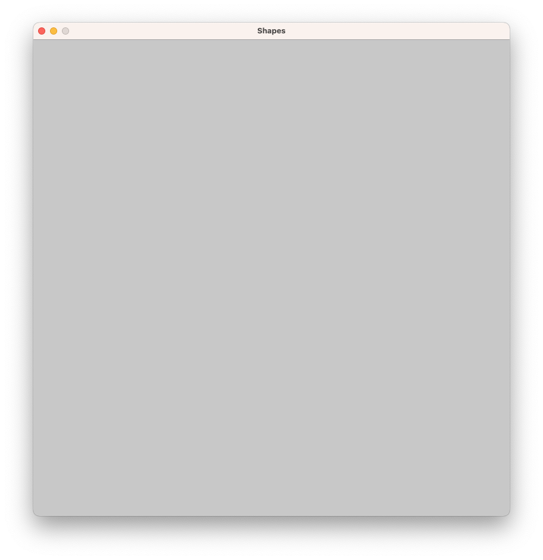
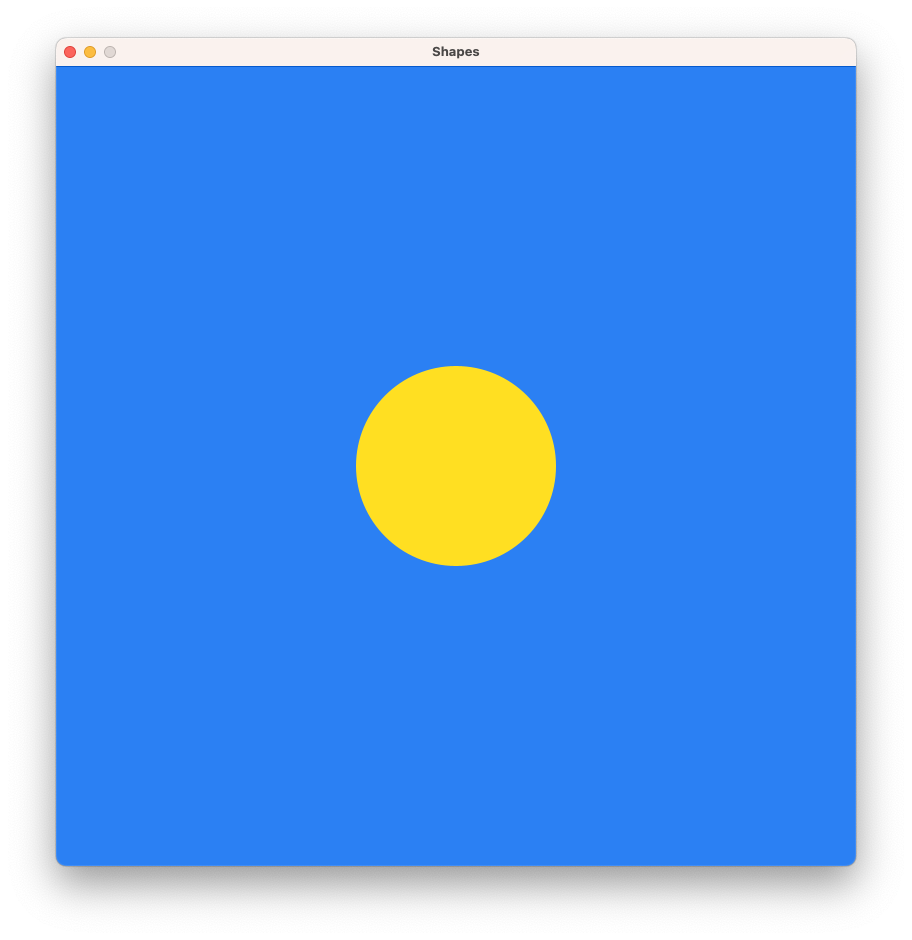
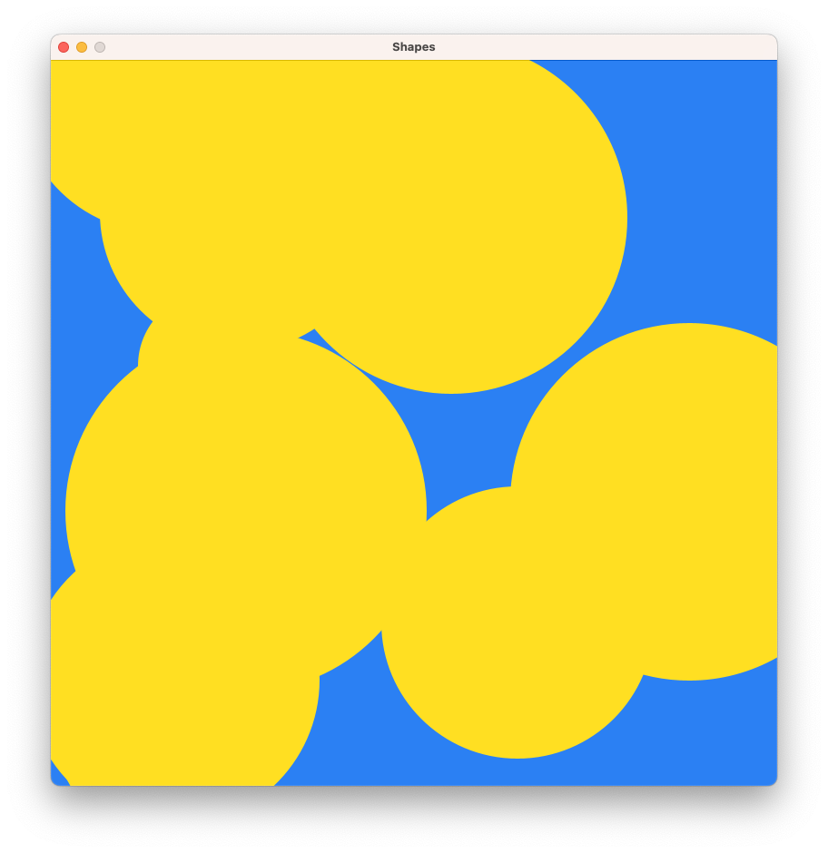

# Schnellstart mit der Zeichenmaschine

Um ein einfaches Projekt mit der **Zeichenmaschine** aufzusetzen ist nicht mehr 
nötig, als die [JAR-Datei der aktuellen Version](https://github.com/jneug/zeichenmaschine/release/latest)
herunterzuladen und dem *Classpath* des Projekts hinzuzufügen. Eine Beschreibung
für verschiedene Entwicklungsumgebungen findet sich im Abschnitt [Installation](install.md).

## Die Basisklasse

Um eine Zeichenmaschine zu erstellen, muss eine Unterklasse von {{ javadoc_link("schule.ngb.zm.Zeichenmaschine") }}
erstellt werden.

```java
public class Shapes extends Zeichenmaschine {
	
}
```

Die gezeigte Klasse ist schon eine lauffähige Zeichenmaschine und kann gestartet
werden.

!!! note

	Bei einigen Entwicklungsumgebungen muss noch eine `main`-Methode erstellt 
	werden, um die Zeichenmaschine zu starten:

	```java
	public static void main(String[] args) {
		new Shapes();
	}
	```

Es öffnet sich ein Zeichenfenster in einer vordefinierten Größe. Um die Größe und 
den Titel des Fensters zu ändern, legen wir einen Konstruktor an.

```java
public class Shapes extends Zeichenmaschine {
	
	public Shapes() {
		super(800, 800, "Shapes");
	}
	
}
```

Starten wir das Projekt nun, wird das Zeichenfenster in der Größe 800x800 mit 
dem Titel "Shapes" angezeigt.

<figure markdown>
{ width=400 }
</figure>

### Formen zeichnen

Eine Zeichenmaschine hat verschiedene Möglichkeiten, Inhalte in das Zeichenfenster 
zu zeichnen. Um einfach nur ein statisches Bild zu erzeugen, überschreiben wir die 
{{ javadoc_link("schule.ngb.zm.Zeichenmaschine", "draw()") }} Methode.

```java
public class Shapes extends Zeichenmaschine {
	
	public Shapes() {
		super(800, 800, "Shapes");
	}
	
	@Override
	public void draw() {
		background.setColor(43, 128, 243);
		
		drawing.setFillColor(255, 223, 34);
		drawing.noStroke();
		drawing.circle(400, 400, 100);
	}
}
```

Nun haben wir einen gelben Kreis (ohne Konturlinie) auf einem blauen Hintergrund 
gezeichnet.

<figure markdown>
{ width=400 }
</figure>

### Vorbereitung der Zeichenfläche

Im Beispiel oben setzen wir die Hintergrundfarbe auf Blau, die Füllfarbe auf Gelb 
und deaktivieren die Konturlinie. Wenn diese Einstellungen für alle Zeichenobjekte 
gleich sind, können wir sie statt in `draw()` auch in die `setup()` Methode schreiben.
Diese bereitet die Zeichenfläche vor dem ersten Zeichnen vor.

```java
public class Shapes extends Zeichenmaschine {

	public Shapes() {
		super(800, 800, "Shapes");
	}
	
	@Override
	public void setup() {
		background.setColor(43, 128, 243);
		
		drawing.setFillColor(255, 223, 34);
		drawing.noStroke();
	}

	@Override
	public void draw() {
		for( int i = 0; i < 10; i++ ) {
			drawing.circle(
				random(0, canvasWidth), 
				random(0, canvasHeight), 
				random(50, 200)
			);
		}
	}
}
```

Im Beispiel setzen wir nun die Grundeinstellungen in der `setup()` Methode. In 
`draw()` werden zehn gelbe Kreise an Zufallskoordinaten gezeichnet.

<figure markdown>
{ width=400 }
</figure>

!!! tip ""

	Mit {{ javadoc_link("Constants", "canvasWidth", title="canvasWidth") }} und {{ javadoc_link("Constants", "canvasHeight", strip_clazz=True) }} kannst du in der Zeichenmaschine auf
	die aktuelle Größe der Zeichenfläche zugreifen. {{ javadoc_link("Constants", "random(int,int)") }}
	erzeugt eine Zufallszahl innerhalb der angegebenen Grenzen.
