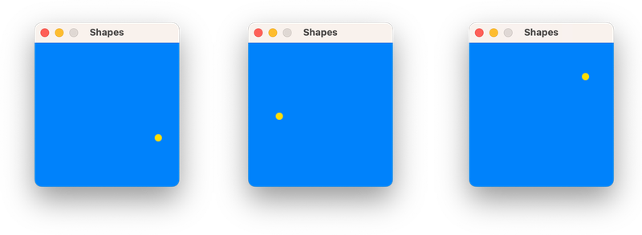
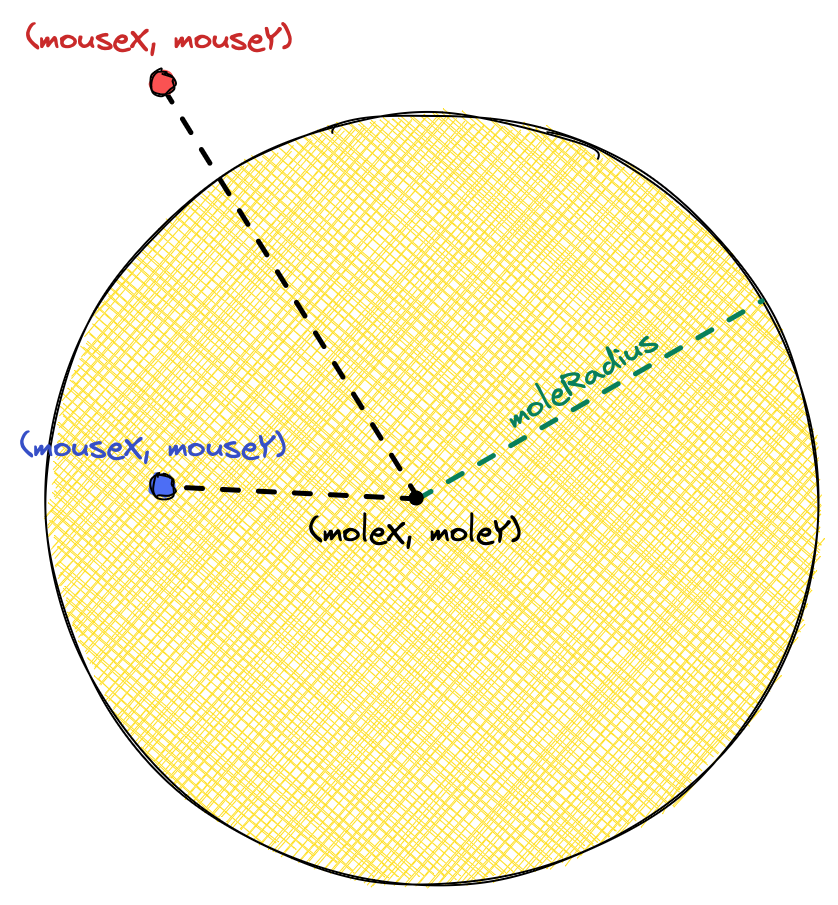
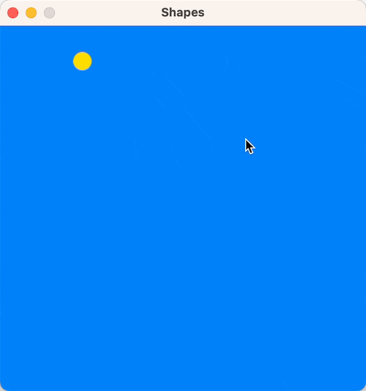
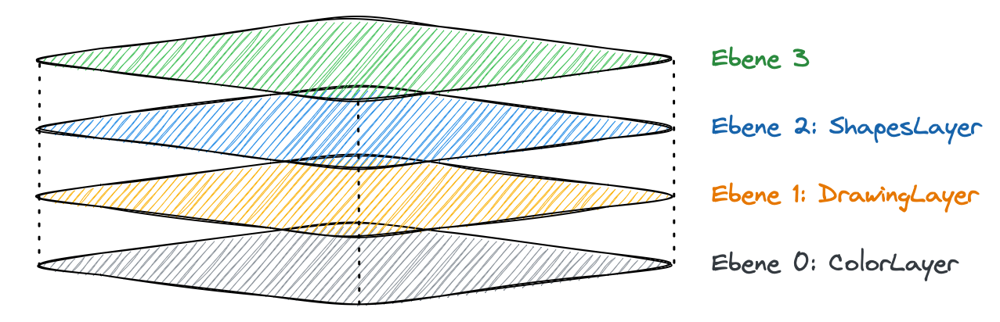
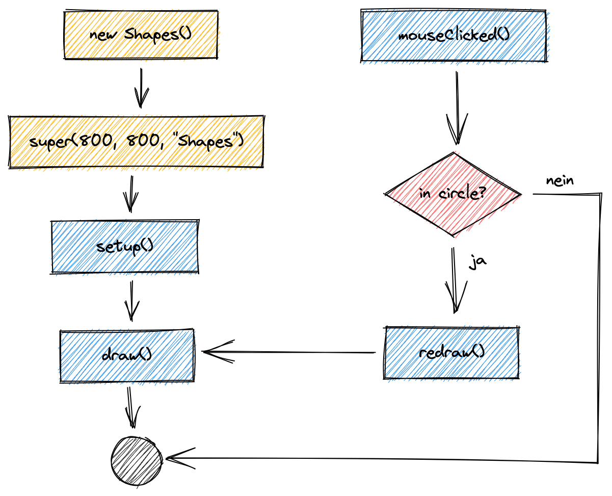
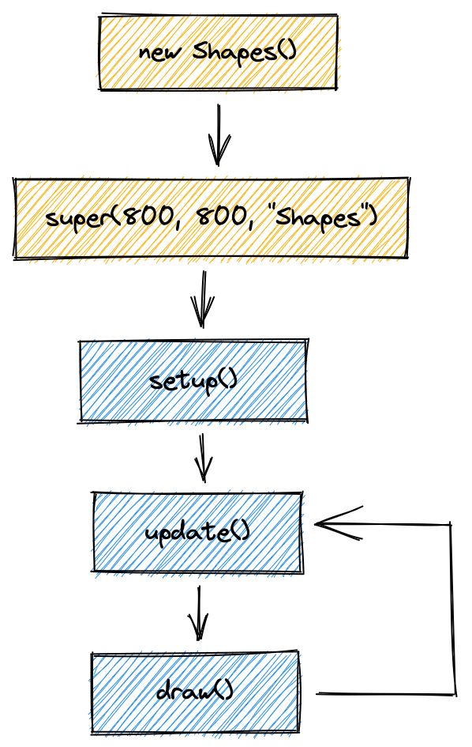
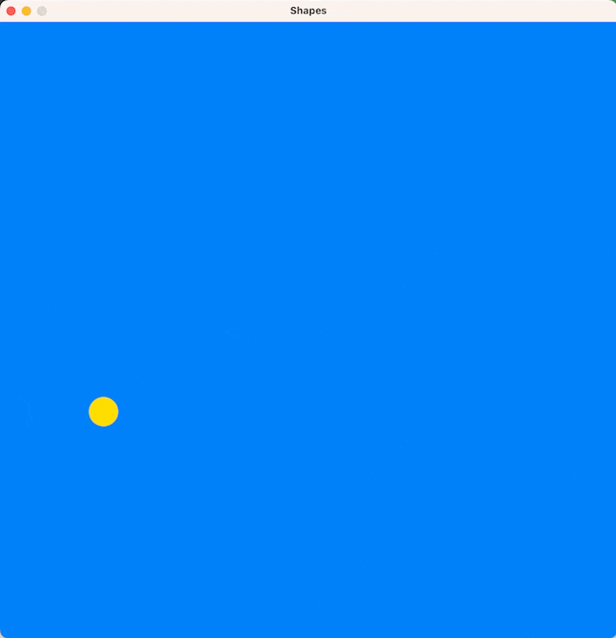
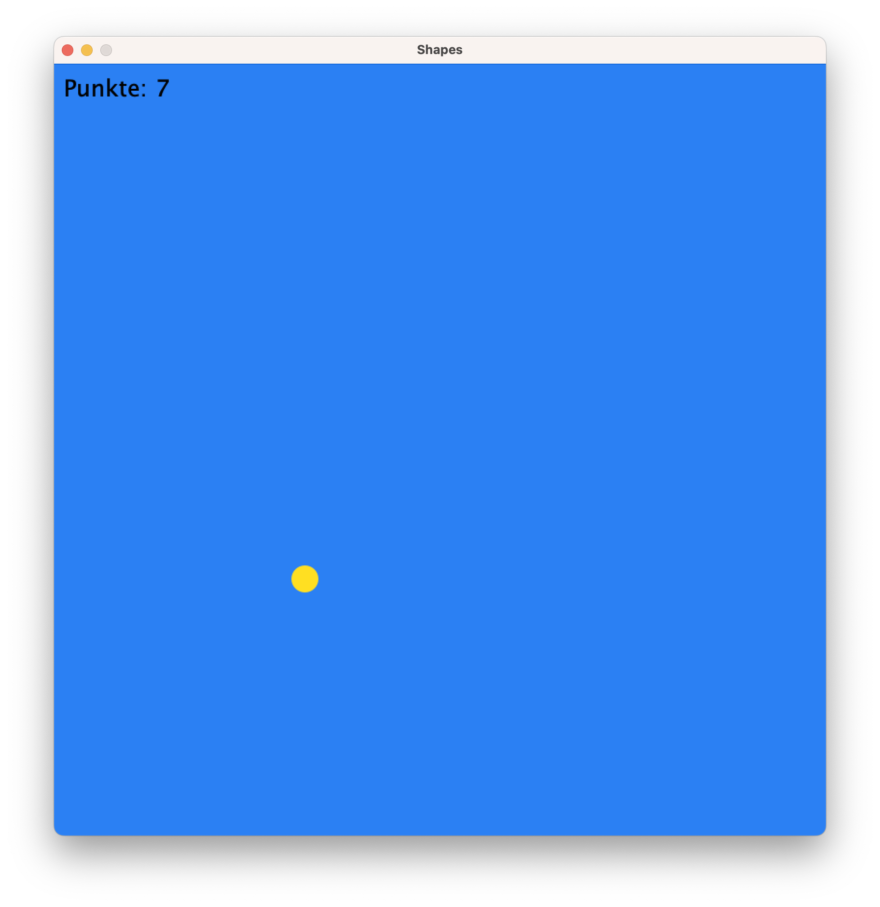

# Schnellstart mit der Zeichenmaschine

Um die **Zeichenmaschine** in einem Projekt zu nutzen ist nicht mehr nötig, als
die [JAR-Datei der aktuellen Version](https://github.com/jneug/zeichenmaschine/release/latest)
herunterzuladen und
dem [Classpath](https://www.delftstack.com/de/howto/java/java-classpath-/)
hinzuzufügen. Eine Beschreibung für verschiedene Entwicklungsumgebungen findet
sich im Abschnitt [Installation](installation.md).

## Die Basisklasse

Eine _Zeichenmaschine_ wird immer als Unterklasse von {{ javadoc_link("
schule.ngb.zm.Zeichenmaschine") }} erstellt.

```java
public class Shapes extends Zeichenmaschine {

}
```

Die gezeigte Klasse ist schon eine lauffähige Zeichenmaschine und kann gestartet
werden.

!!! note "main Methode"

	Bei einigen Entwicklungsumgebungen muss noch eine `main` Methode erstellt 
	werden, um die Zeichenmaschine zu starten:

	```java
	public static void main(String[] args) {
		new Shapes();
	}
	```

Es öffnet sich ein Zeichenfenster in einer vordefinierten Größe. Um die
Abmessungen und den Titel des Fensters zu ändern, legen wir einen Konstruktor
an.

???+ example "Quelltext"

	```java
	public class Shapes extends Zeichenmaschine {
	
		public Shapes() {
			super(800, 800, "Shapes");
		}
	
	}
	```

Starten wir das Projekt, wird eine Zeichenfläche in der Größe 800-mal-800 Pixel
erstellt und in einem Fenster mit dem Titel „Shapes“ angezeigt.

<figure markdown>
{ width=400 }
</figure>

### Formen zeichnen

Eine Zeichenmaschine hat verschiedene Möglichkeiten, Inhalte in das
Zeichenfenster zu zeichnen. Um ein einfaches statisches Bild zu erzeugen,
überschreiben wir die {{ jdl("schule.ngb.zm.Zeichenmaschine", "draw()",
c=False) }} Methode.

???+ example "Quelltext"

	```java
	public class Shapes extends Zeichenmaschine {
	
		public Shapes() {
			super(800, 800, "Shapes");
		}
	
		@Override
		public void draw() {
			background.setColor(BLUE);
	
			drawing.setFillColor(255, 223, 34);
			drawing.noStroke();
			drawing.circle(400, 400, 100);
		}
	
	}
	```

Wir sehen einen gelben Kreis (ohne Konturlinie) auf einem blauen Hintergrund.

<figure markdown>
{ width=400 }
</figure>

### Vorbereitung der Zeichenfläche

Im Beispiel oben setzen wir die Hintergrundfarbe auf Blau, die Füllfarbe auf
Gelb und deaktivieren die Konturlinie. Wenn diese Einstellungen für alle
Zeichenobjekte gleich bleiben, können wir sie statt in `draw()` auch in die {{
jdl('Zeichenmaschine', 'setup()', c=False) }} Methode schreiben. Diese bereitet
die Zeichenfläche vor dem ersten Zeichnen vor.

???+ example "Quelltext"

	```java
	public class Shapes extends Zeichenmaschine {
	
		public Shapes() {
			super(800, 800, "Shapes");
		}
	
		@Override
		public void setup() {
			background.setColor(BLUE);
	
			drawing.setFillColor(255, 223, 34);
			drawing.noStroke();
		}
	
		@Override
		public void draw() {
			for( int i = 0; i < 10; i++ ) {
				drawing.circle(
					random(0, canvasWidth),
					random(0, canvasHeight),
					random(50, 200)
				);
			}
		}
	
	}
	```

Im Beispiel setzen wir nun die Grundeinstellungen in der `setup()` Methode. In
`draw()` werden zehn gelbe Kreise an Zufallskoordinaten gezeichnet.

<figure markdown>
{ width=400 }
</figure>

!!! tip ""

	Mit {{ jdm("Constants", "canvasWidth") }} und 
	{{ jdm("Constants", "canvasHeight") }} kannst du in der Zeichenmaschine 
	auf die aktuelle Größe der Zeichenfläche zugreifen.
	{{ jdm("Constants", "random(int,int)") }} erzeugt eine Zufallszahl 
	innerhalb der angegebenen Grenzen.

## Interaktionen mit der Maus: Whack-a-mole

Mit der Zeichenmaschine lassen sich Interaktionen mit der Maus leicht umsetzen.
Wor wollen das Beispielprogramm zu einem
[Whac-A-Mole](https://de.wikipedia.org/wiki/Whac-A-Mole) Spiel erweitern.

Auf der Zeichenfläche wird nur noch ein gelber Kreis an einer zufälligen Stelle
angezeigt. Sobald die Spieler:in auf den Kreis klickt, soll dieser an eine neue
Position springen.

Damit wir den Kreis an eine neue Position springen lassen können, müssen wir
zufällige `x`- und `y`-Koordinaten generieren. Dazu erstellen wir zunächst zwei
_Objektvariablen_ für die Koordinaten, die in der `setup()` Methode mit
zufälligen Werte initialisiert werden. Diese benutzen wir, um die `draw
()` Methode anzupassen.

??? example "Quelltext"

	```Java
	public class Shapes extends Zeichenmaschine {

		private int moleRadius = 20;

		private int moleX;

		private int moleY;
	
		public Shapes() {
			super(800, 800, "Shapes");
		}
	
		@Override
		public void setup() {
			background.setColor(BLUE);
	
			drawing.setFillColor(255, 223, 34);
			drawing.noStroke();

			moleX = random(50, canvasWidth - 50);
			moleY = random(50, canvasHeight - 50);
		}
	
		@Override
		public void draw() {
			drawing.clear();
			drawing.circle(moleX, moleY, moleRadius);
		}
	
	}
	```

<figure markdown>
{ width=600 }
</figure>

Als Nächstes prüfen wir bei jedem Mausklick, ob die Mauskoordinaten innerhalb
des gelben Kreises (des Maulwurfs) liegen. Die Mauskoordinaten sind jederzeit
über die Variablen `mouseX` und `mouseY` abrufbar. Um zu prüfen, ob diese
Koordinaten innerhalb des Kreises liegen, vergleichen wir den Abstand zwischen
Kreismittelpunkt `(moleX, moleY)` und den Mauskoordinaten
`(mouseX, mouseY)` mit dem Radius des Kreises (im Bild grün). Ist die Entfernung
kleiner als der Radius (blauer Kreis), wurde innerhalb des Kreises geklickt.
Sonst außerhalb (roter Kreis).

<figure markdown>
{ width=400 }
</figure>

Den Abstand vom Mittelpunkt zur Maus lässt sich mithilfe des Satzes des
Pythagoras leicht selber berechnen. Die Zeichenmaschine kann uns diese Arbeit
aber auch abnehmen und stellt eine Methode dafür bereit
({{ jdm("Constants", "distance(double,double,double,double)") }}).

Um auf einen Mausklick zu reagieren, ergänzen wir die 
{{ jdm("Zeichenmaschine", "mouseClicked()") }} Methode:

```
@Override
public void mouseClicked() {
	if( distance(moleX, moleY, mouseX, mouseY) < moleRadius ) {
		moleX = random(50, canvasWidth - 50);
		moleY = random(50, canvasHeight - 50);
		redraw();
	}
}
```

??? example "Quelltext"

	```Java
	public class Shapes extends Zeichenmaschine {

		private int moleRadius = 20;

		private int moleX;

		private int moleY;
	
		public Shapes() {
			super(800, 800, "Shapes");
		}
	
		@Override
		public void setup() {
			background.setColor(BLUE);
	
			drawing.setFillColor(255, 223, 34);
			drawing.noStroke();

			moleX = random(50, canvasWidth - 50);
			moleY = random(50, canvasHeight - 50);
		}
	
		@Override
		public void draw() {
			drawing.clear();
			drawing.circle(moleX, moleY, moleRadius);
		}

		@Override
		public void mouseClicked() {
			if( distance(moleX, moleY, mouseX, mouseY) < moleRadius ) {
				moleX = random(50, canvasWidth - 50);
				moleY = random(50, canvasHeight - 50);
				redraw();
			}
		}
	
	}
	```

!!! warning ""

	Der Aufruf von {{ jdm("Zeichenmaschine", "redraw()") }} zeichnet 
	die Zeichenfläche neu, indem die `draw()` Methode erneut aufgerufen wird.
	Du solltest `draw()` niemals direkt aufrufen.

Nun springt der Kreis an eine andere Stelle, wenn er direkt mit der Maus
angeklickt wird.

<figure markdown>
{ width=400 }
</figure>

## Ein paar Details zur Zeichenmaschine

Die _Zeichenmaschine_ wurde stark von der kreativen Programmierumgebung
[Processing](https://processing.org) inspiriert. Wenn Du Processing schon
kennst, dann werden Dir einige der Konzepte der _Zeichenmaschine_ schon bekannt
vorkommen.

### Farben

Farben können auf verschiedene Weisen angegeben werden. Unser Beispiel nutzt
bisher zwei Arten:

1. Die einfachste Möglichkeit sind die _Farbkonstanten_
   wie {{ jdm('Constants', 'BLUE') }} oder {{ jdm('Constants', 'RED') }}. Im 
   Beispiel setzen wir den Hintergrund auf die Farbe `BLUE`.
2. Farben werden häufig im RGB-Farbraum definiert. Dazu wird jeweils der Rot-,
   Grün- und Blauanteil der Farbe als Wert zwischen 0 und 255 angegeben. Im
   Beispiel setzen wir die Farbe der Kreise auf `255, 223, 34`, also viel Rot
   und Grün und nur ein wenig Blau.

### Ebenen

Die Zeichenfläche besteht aus einzelnen {{ jdl("Layer", title="Ebenen") }}, die
auf übereinander liegen. Bis auf die unterste Ebene sind die Ebenen zunächst
durchsichtig, wodurch die Zeichnungen unterer Ebenen durchscheinen.

<figure markdown>
{ width=600 }
</figure>

Eine _Zeichenmaschine_ besitzt zu Beginn drei Ebenen:

1. Die unterste Ebene ist ein {{ jdc("layers.ColorLayer") }}, die nur aus einer
   Farbe (oder einem Farbverlauf) besteht und keine durchsichtigen Bereiche
   besitzt. Im Beispiel setzen wir diese Ebene auf die Farbe `BLUE`.
2. Die nächste Ebene ist ein {{ jdc("layers.DrawingLayer") }}, auf die wir
   unsere Formen zeichnen können. Die Ebene ist zunächst komplett durchsichtig.
3. Die oberste Ebene ist ein {{ jdc("layers.ShapesLayer") }}, die zur
   Darstellung von Form-Objekten der Klasse {{ jdc("shapes.Shape") }} genutzt
   werden kann.

Du kannst einer Zeichenfläche aber auch beliebige neue oder selbst programmierte
Ebenen hinzufügen.

### Ablauf

Die _Zeichenmaschine_ ruft nach dem Start die Methoden in einem festen Ablauf
auf.

<figure markdown>
{ width=500 }
</figure>

Erstellst Du eine _Zeichenmaschine_ (beziehungsweise ein Objekt einer
Unterklasse), dann wird zuerst die {{ jdm('Zeichenmaschine', 'setup()') }} 
Methode ausgeführt. Danach folgt einmalig die 
{{ jdm('Zeichenmaschine', 'draw()') }} Methode und dann endet das Hauptprogramm.

Die Eingaben der Maus werden in einem parallelen Ablauf (einem _Thread_)
abgefangen und daraufhin die {{ jdm('Zeichenmaschine', 'mouseClicked()') }} 
Methode aufgerufen. In unserem Programm prüfen wir, ob mit der Maus
innerhalb des Kreises geklickt wurde und rufen dann 
{{ jdm('Zeichenmaschine', 'redraw()') }} auf, woraufhin ein weiteres Mal 
`draw()` ausgeführt wird.

In _Processing_ wird dies der "statische" Modus genannt, weil das Programm nur
einmal abläuft und dann stoppt. "Statisch" trifft es nicht ganz, da das Programm
ja zum Beispiel durch Mauseingaben auch verändert werden kann. Wichtig ist aber,
dass mit `redraw()` die Zeichenfläche manuell neu gezeichnet werden muss, damit
sich der Inhalt ändert.

## Dynamische Programme

Wir wollen unser kleines Spiel dynamischer machen, indem die Kreise nur drei
Sekunden angezeigt werden und dann von selbst an einen neuen Ort springen.
Schafft man es, den Kreis in dieser Zeit anzuklicken, bekommt man einen Punkt.

Als zusätzliche Herausforderung lassen wir jeden Kreis in den drei Sekunden
immer kleiner werden.

### Die Update-Draw-Schleifen

{ width=200 align=right }

Bisher hat die _Zeichenmaschine_ einmalig `draw()` aufgerufen und dann nur noch
auf Benutzereingaben mit der Maus reagiert. Nun wollen wir das gezeichnete Bild
aber laufend anpassen. Der Kreis soll schrumpfen und nach 3 Sekunden
verschwinden.

Dazu ergänzen wir ein {{ jdl('Zeichenmaschine', 'update(double)', c=False) }}
Methode in unserem Programm. Nun schaltet die _Zeichenmaschine_ in einen
dynamischen Modus und startet die _Update-Draw-Schleife_. Das beduetet, nach
Aufruf von `setup()` wird fortlaufend immer wieder zuerst `update()` und dann
`draw()` aufgerufen.

Jeder Aufruf der `draw()` Methode zeichnet nun die Zeichenfläche neu. Jedes
Bild, das gezeichnet wird (auch, wenn es genauso aussieht, wie das davor), nennt
man ein _Frame_. Von Videospielen kennst Du vielleicht schon den Begriff "
_Frames per second_" (Fps, dt. Bilder pro Sekunde). Er bedeutet, wie oft das
Spiel neue Frames zeichnet, oder in der _Zeichenmaschine_, wie oft `draw()` pro
Sekunde aufgerufen wird. Normalerweise passiert dies genau 60-mal pro Sekunde.

### Lebenszeit eines Kreises

Jeder Kreis soll drei Sekunden zu sehen sein. Daher fügen wir eine neue
Objektvariable namens `moleTime` ein, die zunächst auf drei steht. Da wir auch
Bruchteile von Skeunden abziehen wollen, wählen wir als Datentyp `double`:

```Java
private double moleTime=3.0;
```

Der Parameter `delta`, der `update()` Methode ist der Zeitraum in Sekunden, seit
dem letzten Frame. Subtrahieren wir diesen Wert bei jedem Frame von `moleTime`,
wird der Wert immer kleiner. Dann müssen wir nur noch prüfen, ob er kleiner Null
ist und in dem Fall den Kreis auf eine neue Position springen lassen.

Die Größe des Kreises passen wir so an, dass der Anteil der vergangenen Zeit die
Größe des Kreises bestimmt:

```Java
drawing.circle(moleX,moleY,moleRadius*(moleTime/3.0));
```

??? example "Quelltext"

	```Java
	import schule.ngb.zm.Zeichenmaschine;
	
	public class Shapes extends Zeichenmaschine {
	
		private int moleRadius = 20;
	
		private int moleX;
	
		private int moleY;
	
		private double moleTime;
	
		public Shapes() {
			super(800, 800, "Shapes");
		}
	
		@Override
		public void setup() {
			background.setColor(BLUE);
	
			drawing.setFillColor(255, 223, 34);
			drawing.noStroke();
	
			randomizeMole();
		}
	
		private void randomizeMole() {
			moleX = random(moleRadius*2, canvasWidth - moleRadius*2);
			moleY = random(moleRadius*2, canvasHeight - moleRadius*2);
			moleTime = 3.0;
		}
	
		@Override
		public void update( double delta ) {
			moleTime -= delta;
	
			if( moleTime <= 0 ) {
				randomizeMole();
			}
		}
	
		@Override
		public void draw() {
			drawing.clear();
			drawing.circle(moleX, moleY, moleRadius * (moleTime / 3.0));
		}
	
		@Override
		public void mouseClicked() {
			if( distance(moleX, moleY, mouseX, mouseY) < moleRadius ) {
				randomizeMole();
				redraw();
			}
		}
	
		public static void main( String[] args ) {
			new Shapes();
		}
	
	}
	```

<figure markdown>
{ width=400 }
</figure>

!!! tip ""

	Der Maulwurf muss mittlerweile an drei verschiedenen Stellen im Programm
	auf eine zufällige Position gesetzt werden (am Anfang, wenn er angeklickt 
	wurde und wenn die drei Sekunden abgelaufen sind). Daher wurde das Versetzen
	in eine eigene Methode `randomizeMole()` ausgelagert. 

### Punktezähler

Zum Schluss wollen wir noch bei jedem Treffer mit der Maus die Punkte Zählen und
als Text auf die Zeichenfläche schreiben.

Dazu ergänzen wir eine weitere Objektvariable `score`, die in `mouseClicked()`
erhöht wird, falls der Kreis getroffen wurde.

Um den Punktestand anzuzeigen ergänzen wir in `draw()` einen Aufruf von 
{{ jdl('layers.DrawingLayer', 'text(java.lang.String,double,double,schule.ngb.zm.Options.Direction)') }} 
mit dem  Inhalt von `score` und den Koordinaten, an denen der Text gezeigt 
werden soll.
Die Zeichenebene zeichnet im Moment alle Formen und Text ausgehend vom Zentrum
der Form. Damit der Text 10 Pixel vom Rand entfernt links oben angezeigt wird,
können wir der Text Methode (und allen anderen, die etwas zeichnen) eine {{
jdl('Options.Direction', title='Richtung') }} übergeben, die festlegt, von
welchem Ausgangspunkt (oder _Ankerpunkt_) die Form gezeichnet werden soll.

```Java
drawing.setFillColor(BLACK);
	drawing.text("Punkte: "+score,10,10,NORTHWEST);
```

<figure markdown>
{ width=400 }
</figure>

??? example "Quelltext"

	```Java
	import schule.ngb.zm.Zeichenmaschine;
	
	public class Shapes extends Zeichenmaschine {
	
		private int moleRadius = 20;
	
		private int moleX;
	
		private int moleY;
	
		private double moleTime;
	
		private int score = 0;
	
		public Shapes() {
			super(800, 800, "Shapes");
		}
	
		@Override
		public void setup() {
			background.setColor(BLUE);
	
			drawing.noStroke();
			drawing.setFontSize(24);
	
			randomizeMole();
		}
	
		private void randomizeMole() {
			moleX = random(moleRadius*2, canvasWidth - moleRadius*2);
			moleY = random(moleRadius*2, canvasHeight - moleRadius*2);
			moleTime = 3.0;
		}
	
		@Override
		public void update( double delta ) {
			moleTime -= delta;
	
			if( moleTime <= 0 ) {
				randomizeMole();
			}
		}
	
		@Override
		public void draw() {
			drawing.clear();
	
			drawing.setFillColor(255, 223, 34);
			drawing.circle(moleX, moleY, moleRadius * (moleTime / 3.0));
	
			drawing.setFillColor(BLACK);
			drawing.text("Punkte: " + score, 10, 10, NORTHWEST);
		}
	
		@Override
		public void mouseClicked() {
			if( distance(moleX, moleY, mouseX, mouseY) < moleRadius ) {
				score += 1;
				randomizeMole();
				redraw();
			}
		}
	
		public static void main( String[] args ) {
			new Shapes();
		}
	
	}
	```

## Wie es weitergehen kann

In diesem Schnellstart-Tutorial hast Du die Grundlagen der _Zeichenmaschine_
gelernt. Um weiterzumachen, kannst Du versuchen, das Whack-a-mole Spiel um diese
Funktionen zu erweitern:

- Mehrere "Maulwürfe" gleichzeitig.
- Unterschiedliche Zeiten pro Maulwurf.

Wenn Du mehr über die Möglichkeiten lernen möchtest, die Dir die
_Zeichenmaschine_ bereitstellt, kannst Du Dir die weiteren Tutorials in dieser
Dokumentation ansehen. Ein guter Startpunkt ist das
[Aquarium](tutorials/aquarium/aquarium1.md).

Viele verschiedene Beispiele, ohne detailliertes Tutorial, findest Du in der
Kategorie Beispiele und auf GitHub im Repository
[jneug/zeichenmaschine-examples](https://github.com/jneug/zeichenmaschine-examples).
